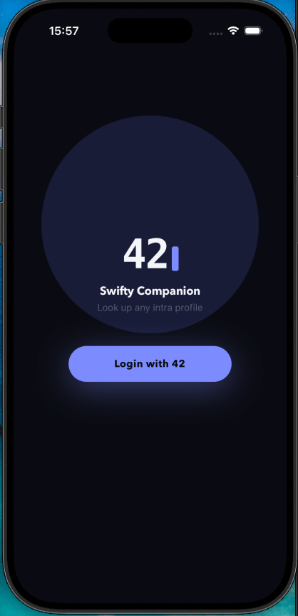
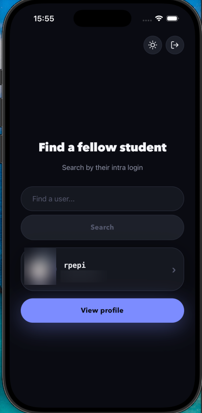
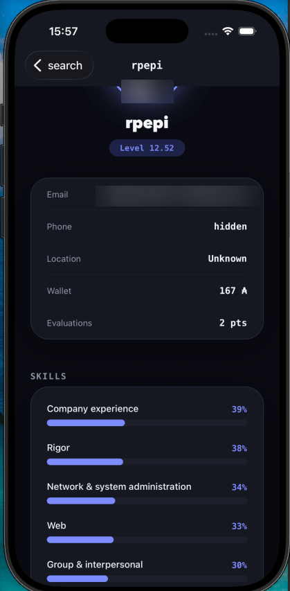

<div align="center">

# Swifty Companion

**Look up any 42 student — their level, skills and projects.**

A two-screen iOS app built with React Native, authenticating against the 42 intra API via OAuth2.

[](https://docs.expo.dev/versions/v54.0.0/)
[](https://reactnative.dev/)
[](https://www.typescriptlang.org/)
[](https://zod.dev/)
[](https://api.intra.42.fr/apidoc)

</div>

---

## Features

| | |
|---|---|
| **OAuth2 login** | Full authorization-code flow against 42 intra, token cached in the device keychain |
| **Auto-refresh** | Expired access tokens are refreshed transparently — no forced re-login |
| **Student search** | Look up any intra login, with explicit handling for unknown users |
| **Rich profile** | Avatar, level, email, phone, location, wallet and evaluation points |
| **Skills** | Every skill with its level and a proportional progress bar |
| **Projects** | Completed, failed and in-progress projects with their final marks |
| **Light & dark** | Follows the system theme, with a manual toggle |
| **Adaptive layout** | Flexbox throughout — scales from iPhone SE to iPad |

## Screens

<div align="center">
<table>
<tr>
<td align="center" width="33%"></td>
<td align="center" width="33%"></td>
<td align="center" width="33%"></td>
</tr>
<tr>
<td align="center"><b>Login</b><br><sub>OAuth2 entry point</sub></td>
<td align="center"><b>Search</b><br><sub>Look up an intra login</sub></td>
<td align="center"><b>Profile</b><br><sub>Details, skills, projects</sub></td>
</tr>
</table>
<sub>Personal details are blurred in these captures.</sub>
</div>

```
      /                   /search                /profile/[login]
 ┌───────────┐         ┌───────────┐             ┌───────────┐
 │           │         │  Find a   │             │    ( )    │
 │    42     │  ────▶  │  fellow   │   ─────▶    │   jdoe    │
 │  Sign in  │         │  student  │             │  Lv 8.42  │
 │           │         │           │   ◀─────    │  skills   │
 └───────────┘         └───────────┘    back     │  projects │
                                                 └───────────┘
```

## Getting started

### Prerequisites

- **macOS with Xcode**, and at least one iOS simulator runtime installed
- **Node.js 20+**
- A **42 API application** — create one at [profile → API → register a new app](https://profile.intra.42.fr/oauth/applications/new)

> [!IMPORTANT]
> Set the redirect URI of your 42 application to exactly `swiftycompanion://callback`.
> A bare `swiftycompanion://` is rejected by the registration form as "not an absolute URI" — it needs a path segment.

### Install

```bash
git clone <this-repo> && cd swifty_companion
npm install
```

### Configure

Copy the template and fill in the credentials of your own 42 application:

```bash
cp .env.example .env
```

```ini
EXPO_PUBLIC_API42_UID=u-s4t2ud-...
EXPO_PUBLIC_API42_SECRET=s-s4t2ud-...
```

> [!WARNING]
> `.env` is git-ignored and must stay that way. Note that 42 rotates each application's client
> secret **every month**, so this file needs refreshing periodically.

### Run

```bash
npx expo run:ios
```

> [!NOTE]
> **Expo Go will not work here.** The OAuth redirect uses the custom URL scheme
> `swiftycompanion://`, and a custom scheme only resolves to an app that registered it in its own
> native bundle — Expo Go owns `exp://`. This project therefore needs a dev build
> (`expo-dev-client`), which `expo run:ios` produces. The first build takes a few minutes; later
> ones are cached.

Target a specific device:

```bash
npx expo run:ios --device "iPad Pro 11"
```

## Tech stack

| Layer | Choice | Why |
|---|---|---|
| Framework | **Expo SDK 54** + React Native | Managed native builds without hand-writing Xcode config |
| Routing | **Expo Router** | File-based routes, native stack navigation and back gesture for free |
| Auth | **expo-auth-session** | Handles the OAuth2 authorization-code flow and the redirect round-trip |
| Storage | **expo-secure-store** | Tokens live in the iOS keychain, not in plain `AsyncStorage` |
| Validation | **Zod** | Validates API responses at *runtime*, not just at compile time |
| Language | **TypeScript** (strict) | `strictNullChecks` catches the missing-null bugs this API is full of |

## Project structure

```
app/
├── _layout.tsx          Root <Stack> and theming
├── index.tsx            Login screen — OAuth2 entry point
├── search.tsx           Search a login
└── profile/
    └── [login].tsx      Profile screen
components/
├── ProfileHeader.tsx    Avatar, level pill and detail card
├── SkillsSection.tsx    Skill bars with percentages
├── ProjectsSection.tsx  Project list with pass/fail marks
├── SearchBar.tsx
└── ViewProfile.tsx
lib/
└── auth.ts              Token validity, refresh and retrieval
types/
└── user42.ts            Zod schema for GET /v2/users/:login
constants/
└── styles.tsx           Shared theme, spacing and typography
```

## Design notes

<details>
<summary><b>One token, reused — never one per request</b></summary>

<br>

The access token is fetched once at login and stored in the keychain. Every screen calls a single
`tokenStillValid()` helper that returns a *usable* access token, refreshing it first if it has
expired.

Collapsing "check validity" and "get the token" into one call is deliberate. Keeping them apart
makes it possible to read the token *before* a refresh replaces it, and then send the stale one —
a bug that surfaces as an opaque `401` well away from its cause.

</details>

<details>
<summary><b>Runtime validation with Zod</b></summary>

<br>

A TypeScript `interface` is erased at build time and asserts nothing about what the API actually
returned. `user42Schema.parse()` checks the payload at runtime, so a shape change surfaces as a
caught error instead of an `undefined` crash deep in the render tree.

The 42 API has a few quirks the schema pins down:

- `cursus_users` is an **array** — a student can be enrolled in several cursus at once
- the project outcome field is literally named `"validated?"`, question mark included, so it must
  be quoted as a string key everywhere (`p["validated?"]`, not `p.validated?`, which parses as
  optional chaining)
- `phone`, `location`, `image` and `grade` are **nullable** — the API omits them for students who
  hid them for privacy

</details>

<details>
<summary><b>Students without a 42cursus</b></summary>

<br>

Piscine-only accounts have no cursus with slug `42cursus`. Rather than rendering an empty screen,
the profile falls back to whatever cursus the student does have, and shows an explicit "No cursus"
state when there is genuinely none.

</details>

<details>
<summary><b>The embedded client secret trade-off</b></summary>

<br>

42's web application flow documents only the classic authorization-code exchange — `client_id` +
`client_secret` + `code` at `POST /oauth/token` — with **no PKCE support**. Since
`expo-auth-session` enables PKCE by default, the request explicitly sets `usePKCE: false`.

That leaves the client secret embedded in the app bundle. The alternative — a small proxy server
holding the secret — was weighed and set aside for a school project of this scope. Two things
bound the exposure: the secret is never committed to git, and 42 rotates it monthly, so a leak is
valid for at most 30 days.

This design would not survive a real App Store release, which would need either a rebuild every
month or that proxy server.

</details>

## Requirements checklist

- [x] At least two views, with back navigation
- [x] All error cases handled — unknown login, network failure, expired session
- [x] Profile picture plus six details (login, email, phone, level, location, wallet, evaluations)
- [x] Skills with level and percentage
- [x] Projects including failed ones
- [x] Flexible layout, adapting across screen sizes
- [x] One cached token, never one per query
- [x] Credentials kept in a git-ignored `.env`
- [x] **Bonus** — token refreshed automatically on expiry

---

<div align="center">
<sub>A 42 school project · Mobile Initiation</sub>
</div>
